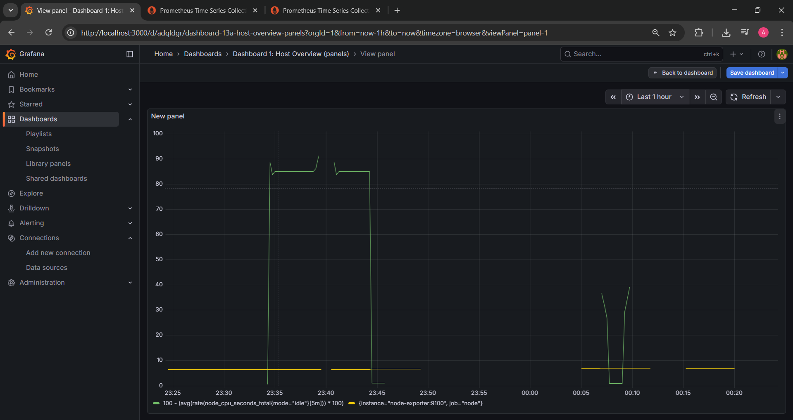
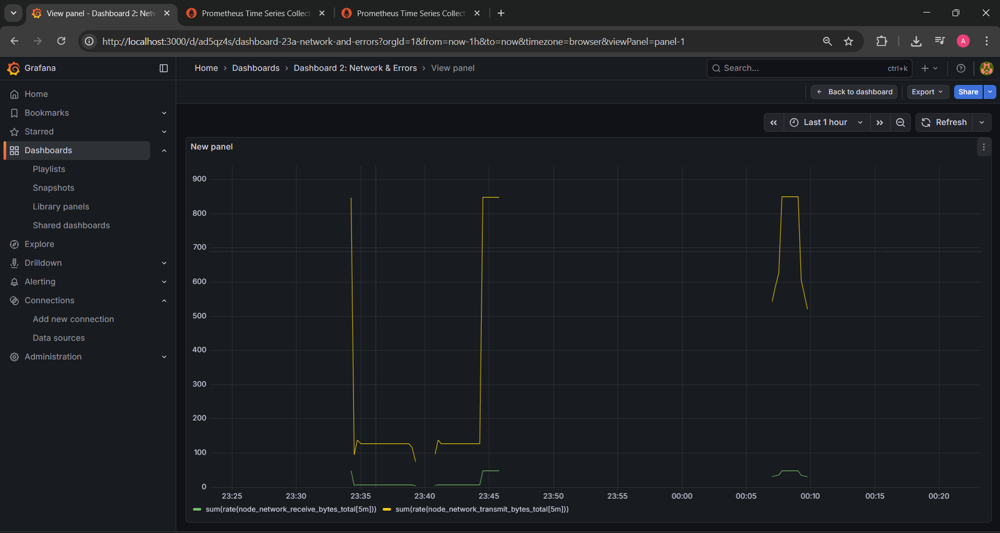
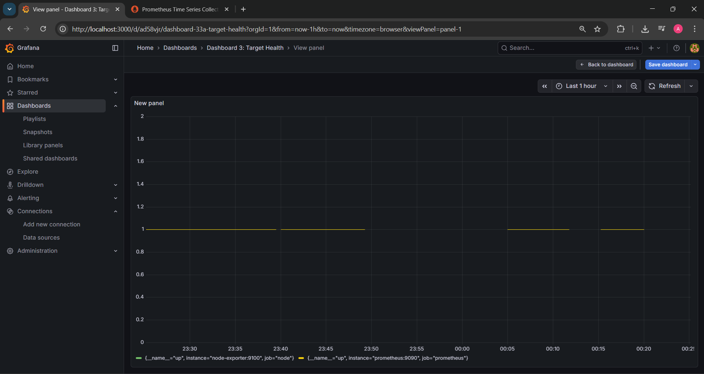
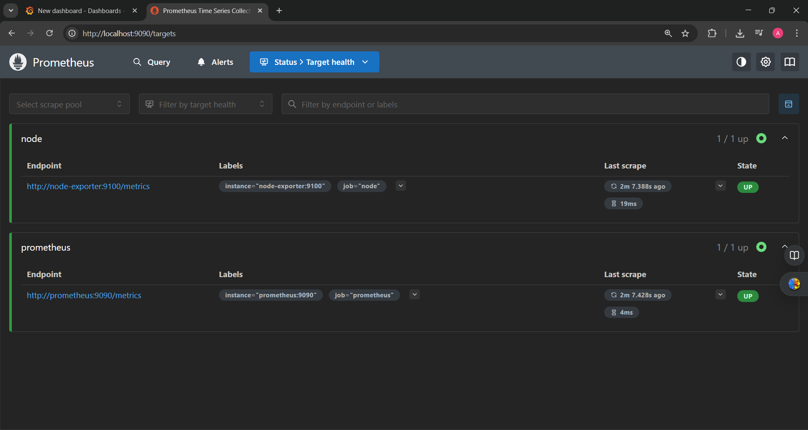
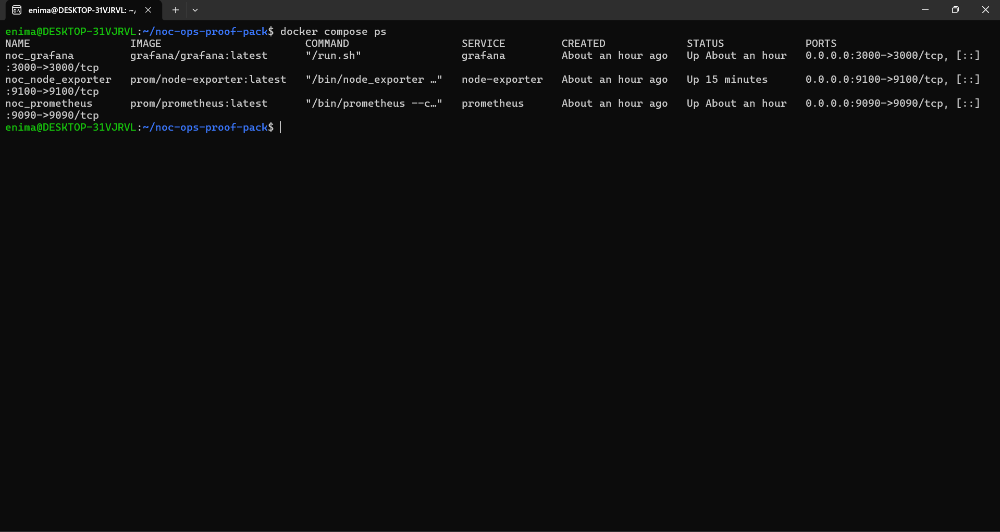
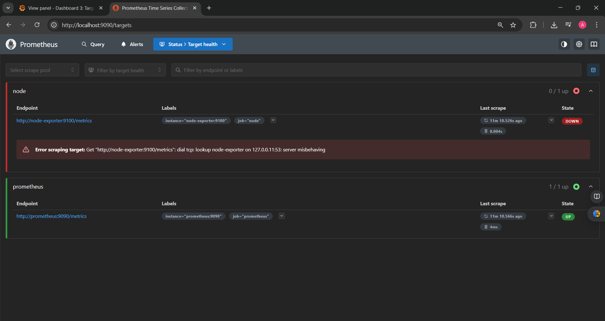
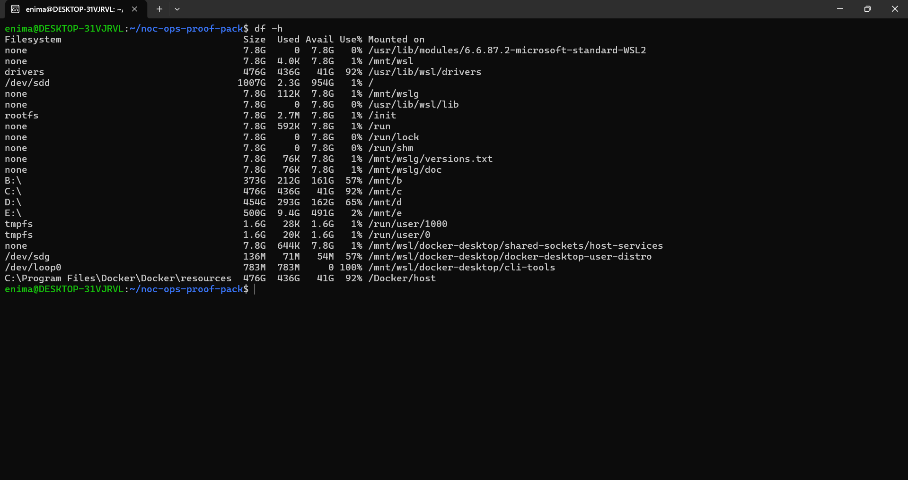

# NOC / Network Ops Proof Pack (Junior-ready)

A compact portfolio proving **real NOC / Ops work**: monitoring + alerting, target health validation, incident-style writeups, runbooks, and small automation scripts.

Designed to run easily on **Windows + WSL2 Ubuntu** with **Docker Desktop**.

---

## What this proves 
- Set up **monitoring + alerting** (Prometheus/Grafana) and verify **targets UP/DOWN**
- Triage incidents using **symptoms → checks → fix → prevention**
- Document clearly (runbooks + incident reports) and automate common checks (scripts)

---

## Stack
- **Prometheus** (metrics + alert rules)
- **Grafana** (dashboards)
- **Node Exporter** (host metrics)
- **Docker Compose** (local lab)

Ports:
- Grafana: `http://localhost:3000` (admin / admin)
- Prometheus: `http://localhost:9090`
  - Targets: `http://localhost:9090/targets`
  - Alerts: `http://localhost:9090/alerts`

---

## Repo contents

### Monitoring Lab
- Prometheus + Grafana + Node Exporter (Docker Compose)
- Alert rules:
  - `InstanceDown`
  - `HighCPUUsage`
  - `LowDiskSpaceRoot`
  - `LowDiskSpaceMntC` (WSL/Windows host disk)

### Documentation (Ops-style)
- Runbooks (5):
  - [Service Down](runbooks/RUNBOOK_Service_Down.md)
  - [DNS Issue](runbooks/RUNBOOK_DNS_Issue.md)
  - [High CPU](runbooks/RUNBOOK_High_CPU.md)
  - [Disk Full](runbooks/RUNBOOK_Disk_Full.md)
  - [Timeout vs Refused](runbooks/RUNBOOK_Network_Timeout_vs_Refused.md)
- Alert playbook:
  - [ALERT_PLAYBOOK](runbooks/ALERT_PLAYBOOK.md)
- Incident writeups (3):
  - [INCIDENT_Service_Down](incidents/INCIDENT_Service_Down.md)
  - [INCIDENT_Disk_Full](incidents/INCIDENT_Disk_Full.md)
  - [INCIDENT_DNS](incidents/INCIDENT_DNS.md)

### Automation
- `scripts/healthcheck.py` — DNS/TCP/HTTP checks (PASS/FAIL)
- `scripts/log_triage.py` — summarizes common error patterns in a log file

---

## Quick Start

### 1) Start the stack
```bash
docker compose up -d
docker compose ps
````

### 2) Stop the stack

```bash
docker compose down
```

---

## Evidence (screenshots)










---

## Incident drills (reproducible)

### Drill A — InstanceDown (exporter scrape failure)

```bash
docker stop noc_node_exporter
# wait 1–2 minutes, check /targets and /alerts
docker start noc_node_exporter
```

Then confirm:

* Prometheus Targets returns to **UP**
* Alert returns to **inactive**

### Drill B — Disk risk workflow (WSL/Windows host)

```bash
df -h
sudo du -sh /* 2>/dev/null | sort -h | tail
```

Document:

* biggest consumers
* safe cleanup steps
* prevention actions (retention/logrotate/alerts)

---

## Scripts usage

### Health checks

```bash
python3 scripts/healthcheck.py
python3 scripts/healthcheck.py --dns google.com github.com --tcp localhost:3000 localhost:9090 --http http://localhost:3000 http://localhost:9090/-/ready
```

### Log triage

```bash
python3 scripts/log_triage.py /path/to/logfile.log
python3 scripts/log_triage.py /path/to/logfile.log --top 30
python3 scripts/log_triage.py /path/to/logfile.log --patterns ERROR Exception timeout refused failed
```

---

## Troubleshooting (WSL2/Docker Desktop)

If `docker compose restart prometheus` fails with a bind-mount error, recreate containers:

```bash
docker compose down --remove-orphans
docker compose up -d --force-recreate
```

If it still persists, reset WSL then retry:

```powershell
wsl --shutdown
```


